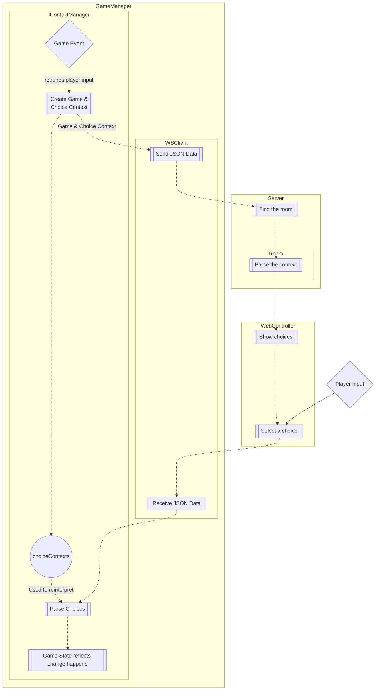


# Input Management Overview

Legend: 
- Circles: `ins` refers to instances of the object. 
- Diamond: Events

```mermaid
graph TD
subgraph GameManager
	subgraph WSClient
		wsClient.send[[Send JSON Data]]
		wsClient.receive[[Receive JSON Data]]
	end
	
	subgraph IContextManager
		Event{Game Event}
		contextManager.createContext[[Create Game &  <br>Choice Context]]-..->
		choiceContexts((choiceContexts))-.Used to reinterpret.->
		contextManager.parse[[Parse Choices]]
		contextManager.action[[Game State reflects change happens]]
	end
end


subgraph WebController
	wc.show[[Show choices]]
	wc.select[[Select a choice]]
end

subgraph Server
server.findRoom[[Find the room]]
	
	subgraph Room
		room.parse[[Parse the context]]
	end
end
Event --requires player input-->
contextManager.createContext -.Game & Choice Context.->wsClient.send
wsClient.send-..->server.findRoom
server.findRoom -..->room.parse
room.parse -..->wc.show-..->wc.select
PlayerInput{Player Input} -->	wc.select[[Select a choice]]-...->wsClient.receive-..->contextManager.parse-..->contextManager.action

```