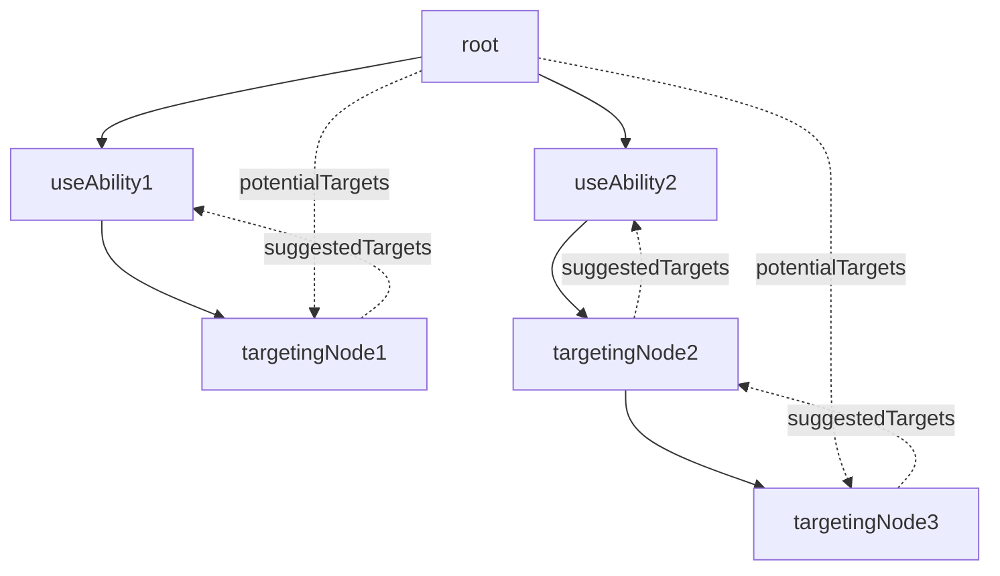

# BehaviorTree

Root behavior Node is essentially a MonoSelector Node. If one of it's children node return success, it will use that action/ability.

All of `Root`'s children should be `IExecutableNodes`.

We can split the children node if we want more complex behavior

UseAbilityNode will have the ability information and during initialization it will look for all the targets within range of the ability. It sets this data in itself.

Every subsequent ITargetingNode will look for this information in the very first parent that has this information, using GetPotentialTargets

During evaluation, the ITargetingNode will then produce a new list of targets using SuggestPotentialTargets

The basic flow is that we pull information down

